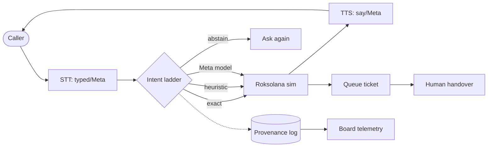
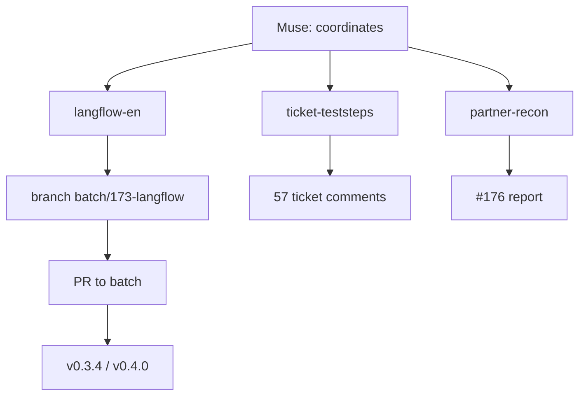

# Architecture #architecture

```mermaid
flowchart LR
    CALLER([Caller]) --> HEAR[STT: typed/Meta]
    HEAR --> LADDER{Intent ladder}
    LADDER -- exact --> ROBOT
    LADDER -- heuristic --> ROBOT
    LADDER -- Meta model --> ROBOT
    LADDER -- abstain --> ASK[Ask again]
    ROBOT[Roksolana sim] --> TTS[TTS: say/Meta]
    TTS --> CALLER
    ROBOT --> QUEUE[Queue ticket]
    QUEUE --> HANDOVER[Human handover]
    LADDER -.-> PROV[(Provenance log)]
    PROV --> BOARD[Board telemetry]
```

```mermaid
flowchart TB
    ME[Muse: coordinates] --> W1[langflow-en]
    ME --> W2[ticket-teststeps]
    ME --> W3[partner-recon]
    W1 --> B1[branch batch/173-langflow]
    W2 --> TICK[57 ticket comments]
    W3 --> TICK176[#176 report]
    B1 --> PR[PR to batch]
    PR --> REL[v0.3.4 / v0.4.0]
```
